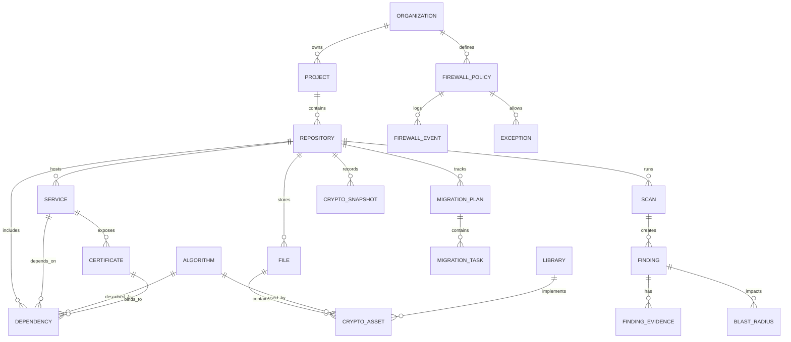

# ER Diagram

```mermaid
erDiagram
    ORGANIZATION ||--o{ PROJECT : owns
    PROJECT ||--o{ REPOSITORY : contains
    REPOSITORY ||--o{ SERVICE : hosts
    REPOSITORY ||--o{ FILE : stores
    FILE ||--o{ CRYPTO_ASSET : contains
    ALGORITHM ||--o{ CRYPTO_ASSET : used_by
    LIBRARY ||--o{ CRYPTO_ASSET : implements
    SERVICE ||--o{ CERTIFICATE : exposes
    REPOSITORY ||--o{ SCAN : runs
    SCAN ||--o{ FINDING : creates
    FINDING ||--o{ FINDING_EVIDENCE : has
    FINDING ||--o{ BLAST_RADIUS : impacts
    REPOSITORY ||--o{ DEPENDENCY : includes
    SERVICE ||--o{ DEPENDENCY : depends_on
    ALGORITHM ||--o{ DEPENDENCY : described_by
    CERTIFICATE ||--o{ DEPENDENCY : binds_to
    REPOSITORY ||--o{ MIGRATION_PLAN : tracks
    MIGRATION_PLAN ||--o{ MIGRATION_TASK : contains
    ORGANIZATION ||--o{ FIREWALL_POLICY : defines
    FIREWALL_POLICY ||--o{ FIREWALL_EVENT : logs
    FIREWALL_POLICY ||--o{ EXCEPTION : allows
    REPOSITORY ||--o{ CRYPTO_SNAPSHOT : records
```
